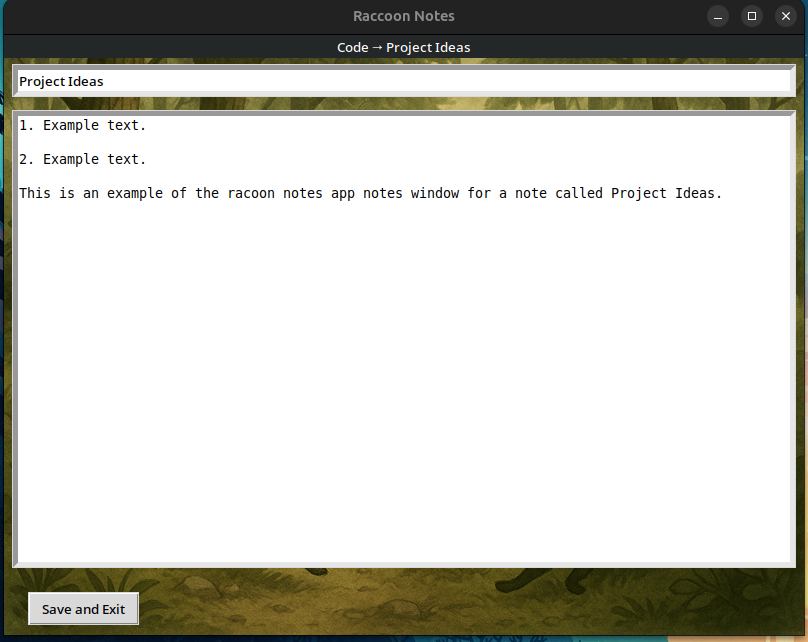

# Raccoon Notes 🦝

Raccoon Notes is a lightweight, raccoon-themed desktop notes app built with Python and Tkinter.  
It helps you organize notes into **stashes** (folders) and **notes** (plain `.txt` files), making it simple, fun, and easy to back up to the cloud or keep on your device.

---

## ✨ Features

- **Stashes (Folders)**  
  - Create, rename, and delete stashes (folders) to organize your notes.  

- **Notes (Plain Text Files)**  
  - Create, edit, rename, and delete notes inside stashes.  
  - Notes are saved as `.txt` files — easy to back up or open in any text editor.  

- **Simple UI**  
  - Raccoon forest background theme.  
  - Grid-based layout with clearly organized buttons.  

- **Safe File Handling**  
  - Ensures unique filenames to prevent overwriting.  
  - Auto-saves when leaving a note.  

---

## 🛠️ Tech Stack

- **Python 3.12** – main programming language  
- **Tkinter** – GUI for the desktop app  
- **Pillow (PIL)** – image handling for backgrounds and icons  
- **OS modules (`os`, `shutil`)** – file and folder management  
- **Ubuntu Desktop (.desktop files)** – system integration and launcher support  
- **Plain Text Storage** – notes saved as `.txt` files inside `~/RaccoonNotes`  


## 📸  Screenshots

### 📸 Home Screen


### Editing a Note



---

## 🎨 App Icon

Raccoon Notes comes with its own custom app icon (`raccoon_icon.png`).  
You can use this icon when creating a desktop shortcut or launcher for the app.

<details>
<summary><strong>Advanced: Add to Applications (Linux/Ubuntu)</strong></summary>

1. Make sure you have the app icon file (e.g., `raccoon_icon.png`) in your project folder.
2. Install Tkinter (GUI support) and Pillow (image support) system-wide:
   ```
   
    sudo apt update
    sudo apt install python3.12-tk python3-pil python3-pil.imagetk -y

   
   ```
3. Run the app manually (First Test)
   ```
    /usr/bin/python3.12 /path/to/raccoon_notes_app.py

   ```

4. Create a `.desktop` file in your applications directory:  
   ```bash
   nano ~/.local/share/applications/raccoon-notes.desktop
   ```
4. Add the following content (update paths if needed):  
   ```
   [Desktop Entry]
   Name=Raccoon Notes
   Comment=Lightweight raccoon-themed notes app
   Exec=/usr/bin/python3.12 /path/to/raccoon_notes_app.py
   Path=/path/to/raccoon_notes
   Icon=/path/to/raccoon_icon.png
   Terminal=false
   Type=Application
   Categories=Utility;
   ```
5. Save and close.  
6. Run:  
   ```bash
   chmod +x ~/.local/share/applications/raccoon-notes.desktop
   ```
7. Now you can find **Raccoon Notes** in your app menu with the custom icon.

</details>


## 🛠️ Installation & Setup

1. Clone this repository:  
   ```bash
   git clone https://github.com/gabrielwaters-create/raccoon_notes.git
   cd raccoon_notes
   ```

2. Install dependencies:  
   ```bash
   pip install pillow
   ```

3. Run the app:  
   ```bash
   python raccoon_notes_app.py
   ```

By default, your notes will be stored in `~/RaccoonNotes`.

---

## 🔮 Future Roadmap

- Scroll bar or pages for the home, stash, and notes menus to manage a large number of notes or stashes. 
- Edit button that displays Delete buttons instead of always being visible.
- Syntax highlighting for code snippets.
- Auto-detection of programming languages (e.g., Python, Java).  
- Simple text editor mode for coding.  
- Additional themes and dark mode.  
- Search functionality for notes.  
- Export/import stashes.
---

## 📜 License

This project is licensed under the **MIT License** — free to use, modify, and share.

---

## 👤 About

Made by **Gabriel Waters**  
Built with **Python, Tkinter, and curiosity.**
